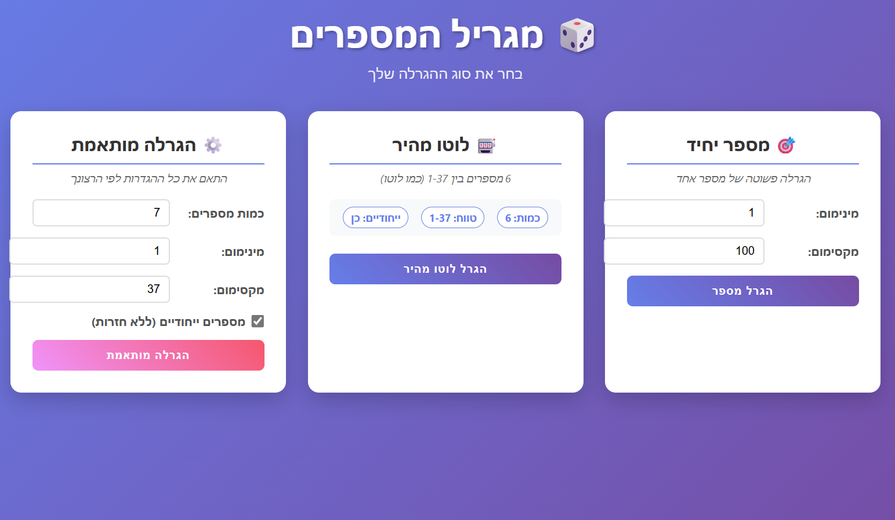
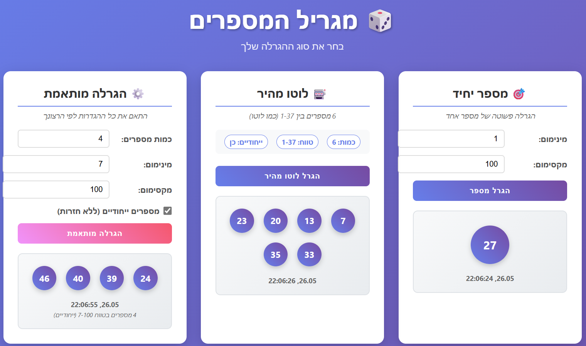
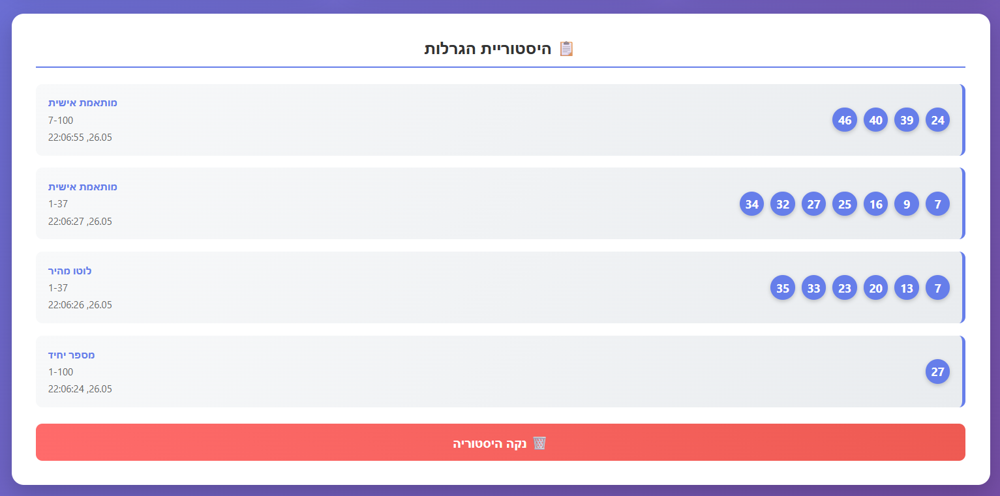

# Lottery Number System

A modern lottery number generator with .NET Core backend and Vue.js frontend.

## Features
- Single number generation
- Multiple number lottery (like Israeli Lotto)
- Custom lottery with flexible settings
- Hebrew interface (RTL support)
- Lottery history tracking
- Responsive design for mobile and desktop

##  Tech Stack
### Backend
- .NET Core 8 Web API
- RESTful API design

### Frontend  
- Vue.js 3 (CDN)
- Vanilla JavaScript
- CSS Grid & Flexbox
- Axios for HTTP requests

## Quick Start

### Backend
```bash
cd backend/LotteryApi
dotnet restore
dotnet run
```

Server runs on: http://localhost:5234

### Frontend
Open `frontend/index.html` in browser or use Live Server

## API Endpoints
* `GET /api/lottery/single` - Generate single number
* `GET /api/lottery/multiple` - Generate multiple numbers
* `POST /api/lottery/custom` - Custom lottery settings
* `GET /api/lottery/health` - Health check

## Usage Examples
* **Israeli Lotto:** 6 numbers between 1-37
* **Dice Roll:** 1 number between 1-6
* **Custom Range:** Any count, any range, with/without duplicates

## Screenshots




## Development
Built with clean architecture:
* Controllers for HTTP handling
* Services for business logic
* Models for data structures
* Configuration for CORS and settings

## Author
Built by Levana Cohen as a full-stack development showcase.
